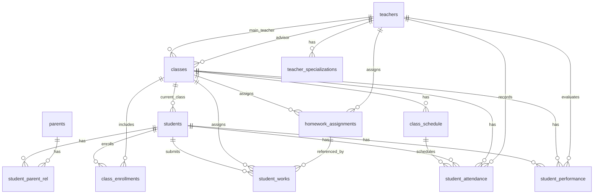

# DoItCRM 项目概览（数据库为核心）

本项目是面向教育机构的 CRM 数据库增强方案，基于 PostgreSQL，聚焦学生学习表现、作业管理、教师专长、班级课程表、考勤与家校沟通分析。

## 文件结构

- `schema.sql`：核心表、索引、触发器、基础视图
- `schema_enhancement.sql`：增强表、索引、增强视图
- `example_queries.sql`：常用业务查询示例
- `chat_data.sql`：企业微信聊天日志数据
- `README.md`：概览说明

## 核心表（schema.sql）

### teachers
- 字段：`id`, `name`, `wechat_id`, `is_active`, `created_at`

### classes
- 字段：`id`, `name`, `room_id`, `main_teacher_id`, `advisor_id`, `is_active`, `created_at`
- 关联：`main_teacher_id`, `advisor_id` → `teachers.id`

### students
- 字段：`id`, `name`, `current_class_id`, `status`, `profile_tags`(JSONB), `points`, `created_at`
- 关联：`current_class_id` → `classes.id`

### parents
- 字段：`id`, `wechat_id`(唯一), `name`, `phone`, `created_at`

### student_parent_rel（学生-家长关系）
- 字段：`student_id`, `parent_id`, `relation`, `is_primary`, `created_at`
- 复合主键：`(student_id, parent_id)`

### class_enrollments（学生班级流转）
- 字段：`id`, `student_id`, `class_id`, `start_date`, `end_date`, `reason`, `created_at`
- 约束：`end_date >= start_date` 或为空
- 唯一索引：同一学生仅允许一条 active 记录

### student_works（作业/作品提交）
- 字段：`id`, `student_id`, `class_id`, `submit_time`, `msg_id`, `teacher_comment`, `score`, `source`, `work_type`, `status`, `created_at`

## 触发器

### sync_current_class_id
`class_enrollments` 变更后自动同步 `students.current_class_id`，确保学生当前班级一致性。

## 基础视图（schema.sql）

### v_messages
对企业微信日志进行规范化，生成统一会话维度 `conversation_id`。

### v_conversation_members
输出会话参与者集合（`conversation_id` + `member_id`）。

## 增强表（schema_enhancement.sql）

### student_performance（学生表现）
- 出勤率、参与度、行为评分、评语、评估人
- 评分约束：0–100

### homework_assignments（作业布置）
- 关联班级与教师
- 支持消息引用 `msg_id`

### teacher_specializations（教师专长）
- 专长领域与等级

### class_schedule（班级课程表）
- `day_of_week` 1–7
- 时间范围、有效期范围约束

### student_attendance（学生考勤）
- 状态：present/late/absent/excused
- 关联课程表与记录教师

### 表变更
`student_works` 增加 `homework_id` → `homework_assignments.id`。

## 增强视图（schema_enhancement.sql）

### v_parent_communications
家长沟通视图（近 6 个月），整合家长、学生、班级、消息、教师信息。

### v_student_performance_summary
学生表现汇总：作业完成、平均出勤率/参与度/行为评分、积分与标签。

### v_class_performance_summary
班级表现汇总：教师、学生人数、作业统计、平均表现指标。

## 索引策略
- 学生表现、作业、课程表、考勤均有覆盖索引
- 关键索引定义位于 `schema.sql` 与 `schema_enhancement.sql`

## 企业微信聊天日志（chat_data.sql）

表：`wecom_chat_logs`  
关键字段：`msgid`, `msgtime`, `msgtype`, `from_user_id`, `room_id`, `tolist`, `content_payload`, `raw_data`

说明：
- 已将 `roomid` 更名为 `room_id`
- 可通过 `v_messages` 统一会话分析

## 当前数据状态（doitcrm）

- `wecom_chat_logs` 已导入数据（约 4k）
- 业务主表（`students`, `teachers`, `classes` 等）目前为空
- 因此 `v_class_performance_summary` 等聚合视图暂时返回空集

## 常用业务查询
详见 `example_queries.sql`，包含：
- 学生综合信息
- 作业完成情况
- 家长沟通记录
- 学生考勤
- 班级表现概览
- 低参与/低出勤学生筛查
- 教师班级与专长统计
- 作业提交率
- 转班影响分析
- 家长互动活跃度

## 后续开发建议

- 补充 `students/teachers/classes/parents` 等基础主数据
- 建立 `wechat_id` 与班级 `room_id` 的映射逻辑
- 视图输出可直接被 API 或 BI 工具消费

## ER 图（Mermaid）

## 字段字典（全表）

### teachers
- `id`：教师 ID
- `name`：姓名
- `wechat_id`：企业微信 ID
- `is_active`：是否在职
- `created_at`：创建时间

### classes
- `id`：班级 ID
- `name`：班级名称
- `room_id`：群聊 ID
- `main_teacher_id`：主教老师 ID
- `advisor_id`：班主任 ID
- `is_active`：是否有效
- `created_at`：创建时间

### students
- `id`：学生 ID
- `name`：姓名
- `current_class_id`：当前班级 ID
- `status`：状态（如 active）
- `profile_tags`：标签（JSONB）
- `points`：积分
- `created_at`：创建时间

### parents
- `id`：家长 ID
- `wechat_id`：企业微信 ID（唯一）
- `name`：姓名
- `phone`：电话
- `created_at`：创建时间

### student_parent_rel
- `student_id`：学生 ID
- `parent_id`：家长 ID
- `relation`：关系（如 父/母）
- `is_primary`：是否主联系人
- `created_at`：创建时间

### class_enrollments
- `id`：记录 ID
- `student_id`：学生 ID
- `class_id`：班级 ID
- `start_date`：开始时间
- `end_date`：结束时间（可空）
- `reason`：转班原因
- `created_at`：创建时间

### student_works
- `id`：作业/作品 ID
- `student_id`：学生 ID
- `class_id`：班级 ID
- `submit_time`：提交时间
- `msg_id`：关联消息 ID
- `teacher_comment`：教师评语
- `score`：评分
- `source`：来源
- `work_type`：类型
- `status`：状态
- `created_at`：创建时间
- `homework_id`：作业布置 ID

### student_performance
- `id`：记录 ID
- `student_id`：学生 ID
- `class_id`：班级 ID
- `evaluation_date`：评估日期
- `attendance_rate`：出勤率
- `participation_score`：参与度评分
- `behavior_score`：行为评分
- `notes`：备注
- `evaluated_by`：评估教师 ID
- `created_at`：创建时间

### homework_assignments
- `id`：作业布置 ID
- `class_id`：班级 ID
- `assigned_by`：布置教师 ID
- `title`：标题
- `description`：描述
- `due_date`：截止时间
- `msg_id`：关联消息 ID
- `created_at`：创建时间

### teacher_specializations
- `teacher_id`：教师 ID
- `specialization`：专长领域
- `level`：等级
- `created_at`：创建时间

### class_schedule
- `id`：课程表 ID
- `class_id`：班级 ID
- `day_of_week`：星期（1-7）
- `start_time`：开始时间
- `end_time`：结束时间
- `effective_from`：生效日期
- `effective_to`：失效日期（可空）
- `created_at`：创建时间

### student_attendance
- `id`：考勤记录 ID
- `student_id`：学生 ID
- `class_id`：班级 ID
- `schedule_id`：课程表 ID
- `status`：状态（present/late/absent/excused）
- `notes`：备注
- `recorded_by`：记录教师 ID
- `created_at`：创建时间

### wecom_chat_logs
- `msgid`：消息 ID
- `action`：动作（send 等）
- `msgtype`：消息类型（text/image/video 等）
- `msgtime`：消息时间
- `from_user_id`：发送人
- `room_id`：群聊 ID
- `tolist`：接收人列表
- `content_payload`：消息内容（JSONB）
- `raw_data`：原始数据（JSONB）
- `created_at`：入库时间

### v_messages
- `msgid`：消息 ID
- `msgtime`：消息时间
- `msgtype`：消息类型
- `from_user_id`：发送人
- `room_id`：群聊 ID
- `content_payload`：内容 JSON
- `raw_data`：原始 JSON
- `content_text`：文本内容
- `conversation_id`：会话 ID（群聊或私聊）

### v_conversation_members
- `conversation_id`：会话 ID
- `member_id`：成员 ID

### v_parent_communications
- `parent_id`：家长 ID
- `parent_name`：家长姓名
- `student_id`：学生 ID
- `student_name`：学生姓名
- `class_id`：班级 ID
- `class_name`：班级名称
- `msgtime`：消息时间
- `content_text`：消息文本
- `conversation_id`：会话 ID
- `communication_type`：群聊/私聊
- `teacher_id`：教师 ID
- `teacher_name`：教师姓名

### v_student_performance_summary
- `student_id`：学生 ID
- `student_name`：学生姓名
- `class_id`：班级 ID
- `class_name`：班级名称
- `total_homework_assigned`：布置作业数
- `total_homework_submitted`：提交作业数
- `avg_attendance_rate`：平均出勤率
- `avg_participation_score`：平均参与度
- `avg_behavior_score`：平均行为评分
- `total_points`：积分
- `profile_tags`：标签 JSON

### v_class_performance_summary
- `class_id`：班级 ID
- `class_name`：班级名称
- `main_teacher`：主教老师
- `advisor`：班主任
- `student_count`：学生数
- `total_homework_assigned`：布置作业数
- `avg_attendance_rate`：平均出勤率
- `avg_participation_score`：平均参与度
- `avg_behavior_score`：平均行为评分
